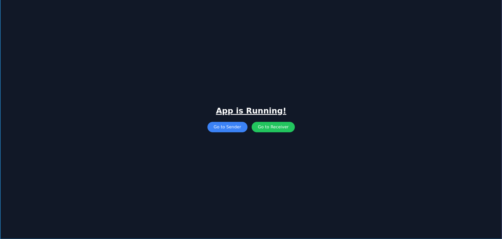
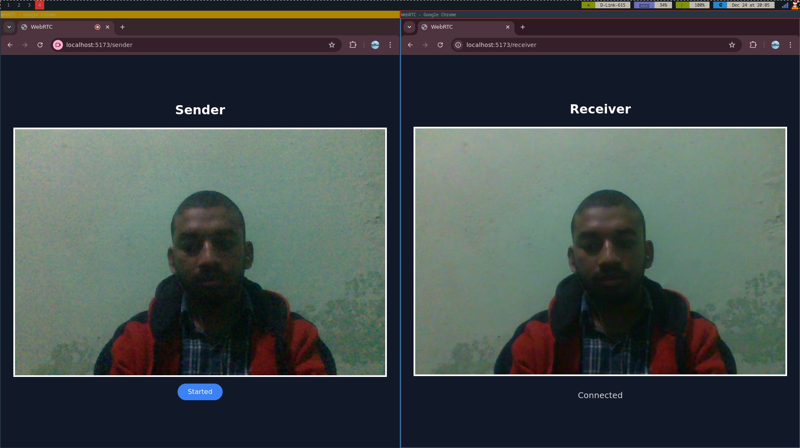

# WebRTC Streaming Project
This is a basic WebRTC project that facilitates live video streaming between a sender and a receiver using WebSockets for signaling. The project includes a server built with Node.js and WebSocket, and a client built with React, TypeScript, and Tailwind CSS.

## Features

-   Real-time video streaming between a sender and a receiver.
    
-   Peer-to-peer connection using WebRTC.
    
-   WebSocket-based signaling server for exchanging SDP offers, answers, and ICE candidates.

## Screenshots




## Prerequisites

Before you begin, ensure you have the following installed on your local machine:

- **git** 
- **Node.js** (v16 or later) 
- **npm** (Node Package Manager)

## Local Setup

1. Clone the Repository

	```bash
	git clone https://github.com/kundusubrata/webrtc.git
	cd webrtc
	```
2. Run the Development Server
	```bash
	# for server side
	cd server
	npm run install 
	npm run build
	npm run dev
	# for client side
	cd client
	npm run install
	npm run dev
	```
	This will start the development server at `http://localhost:5173`.
